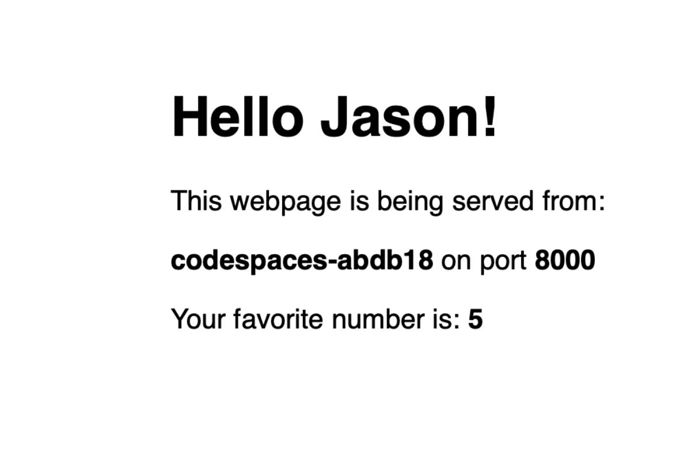

# Remote Development Intro Chapter 3: Server

Last chapter we walked through some coding 101s. In this chapter we are getting a taste of the flexibility of remote development. If you have ever interacted with sandbox coding platforms, you may have noticed some intentional guardrails. A common one is that many sandbox platforms cannot run servers that you can access via browser, for example when you are coding a website. Remote development doesn't have this limitation.

[⬅️ Previous Chapter](https://aspirecodingacademy.com/blog/remote-development-intro-2/)

## Goal

Start a server in Python that can be accessed via your browser.

## Chapter 3: Server

### 1: Open your codespace

On the forked repository from [Chapter 1](https://aspirecodingacademy.com/blog/remote-development-intro-1/), open or re-open your codespace.

### 2: Run `pip install -r requirements.txt` in your terminal.

This is a command which installs the requirements listed in [`requirements.txt`](/requirements.txt). In this chapter we are using the `flask` library, which is not included in the base Python installation, so we need to install it using `pip`, a package manager.

### 3: Open the `server.py` file under `src/chapter3`.

Fill in the TODO comments at the top of the file. Look back to [Chapter 2](https://aspirecodingacademy.com/blog/remote-development-intro-2/) for a refresher on variables, strings, and numbers.

### 4: Your server

In programming, a server is a program that listens for requests from clients (like web browsers). This is a bread-and-butter concept in all sorts of coding projects. We are going to start up a server on your codebase, and access it via your web browser.

After running `python src/chapter3/server.py` in your terminal, you should see this:

Ctrl/Command click on the second link. It will direct you to open an external window, and you should see this:

Since this is an introduction series, we are not going to go into the details of how all of this works. But what we have just done is demonstrates a lot about remote development. Here is a simplified version of what happened in this chapter, and where remote development fits in:

-   When you start a server, the server has an address.
-   When coding on your own machine, generally you would start your server on that same machine.
-   When you run the `python src/chapter3/server.py` command, you are starting a server on your local machine, and it would produce some address that you can access via your (you guessed it!) local machine.
-   But instead of running the server on your local machine, you are running it on your codespace machine.
-   So when you run the command, it produces an address that lives on the codespace machine, which is somewhere in the nebula that is the GitHub data centers.
-   So in order to access that address, we can use the url that codespaces gives us.

### 5. Commit and push your change, using the same steps from [Chapter 2](https://aspirecodingacademy.com/blog/remote-development-intro-2/)

Commit and push your changes to save progress.

## Done ✅

You started a live server on your codespace machine, and accessed it via a web browser. We also reviewed strings, numbers, and git operations. This concludes the Remote Development Intro. We hope this gives you a glimpse into the convenience of remote development without sacrificing functionality. The vast majority of personal coding projects can be completed entirely on remote development.

## Questions?

If you run into issues, contact us at contact@aspirecodingacademy.com. We’re happy to help. Follow us on [LinkedIn](https://www.linkedin.com/company/aspire-coding-academy/) for updates on new blog posts.
